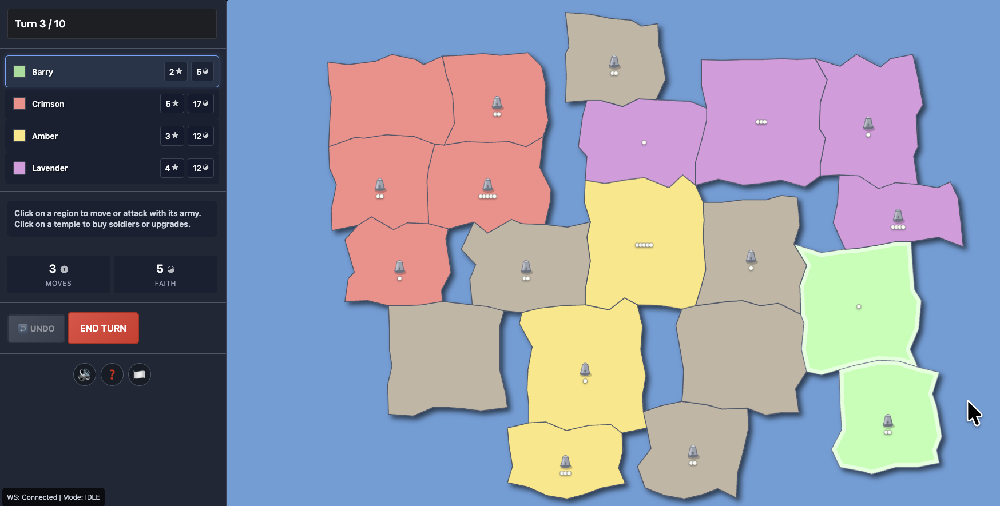

# World Conflict

A multiplayer strategy game built with SvelteKit, using the [multiplayer-framework](../multiplayer-framework) for WebSocket communication.



## 🎮 Features

- ✅ multiplayer gameplay (up to 4 players - AI or human)
- ✅ Strategic combat system inspired by Risk
- ✅ Persistent game state with Cloudflare KV
- ✅ Instant WebSocket updates via Durable Objects
- ✅ Global CDN distribution

## 🚀 Development

### Prerequisites

- Node.js 18+
- Cloudflare account (free tier works)
- Framework WebSocket worker deployed (see [framework docs](../multiplayer-framework/README.md))

### Quick Start

From the monorepo root:

```bash
# Install dependencies
npm install

# Start development (includes WebSocket worker)
npm run dev:full

# Or start just the game (worker runs separately)
npm run dev -w world-conflict
```

Open [http://localhost:5173](http://localhost:5173)

### Configuration

Update the WebSocket worker URL in `src/lib/websocket-config.ts`:

```typescript
export const WEBSOCKET_WORKER_URL = 'https://your-worker.workers.dev';
```

For local development, it defaults to `localhost:8787`.

### Google AdSense

The Google AdSense Publisher ID is configured in `src/app.html` as a meta tag. The AdSense script in `src/routes/+layout.svelte` automatically extracts the Publisher ID from this meta tag, so you only need to update it in one place.

## 🛠️ Development Scripts

```bash
npm run dev              # Start development server
npm run build            # Build for production
npm run preview          # Preview production build
npm test                 # Run unit tests
npm run test:e2e         # Run end-to-end tests
npm run check            # Type-check with svelte-check
npm run deploy           # Deploy to Cloudflare Pages
```

## 🔧 Admin Tools

### Game Statistics

Daily game statistics are automatically tracked and stored in KV with keys like `wc_stats:2025-11-30`. Statistics include:
- Games started, completed, and abandoned
- Player counts (human vs AI)
- Turn statistics (min, max, average)
- Win/loss breakdowns (human vs AI vs drawn)
- Error tracking

### Automatic Cleanup

When a game completes, old game entries (14+ days old) are automatically cleaned up from KV storage. This keeps the storage tidy without manual intervention.

### Manual Cleanup API

An admin endpoint is also available to manually clean up old game entries.

**Get game entry statistics:**
```bash
curl https://svelte-world-conflict.pages.dev/api/admin/cleanup
```

**Dry run (see what would be deleted):**
```bash
curl -X POST "https://svelte-world-conflict.pages.dev/api/admin/cleanup?dryRun=true"
```

**Delete games older than 1 day:**
```bash
curl -X POST "https://svelte-world-conflict.pages.dev/api/admin/cleanup"
```

**Delete games older than N days:**
```bash
curl -X POST "https://svelte-world-conflict.pages.dev/api/admin/cleanup?maxAgeDays=7"
```

> **Note:** When running locally, the cleanup operates on in-memory storage, not production KV. To clean up production, run against the deployed URL or use `wrangler kv:key` commands with the namespace ID from `wrangler.toml`. 


## 🎮 How to Play

1. **Create a game** - Choose map size, player slots (human/AI/disabled)
2. **Wait for players** - Share the game link or start with AI
3. **Take turns** - Each turn you can:
   - Move armies between adjacent regions you control
   - Attack adjacent enemy regions
   - Build up forces in your regions
4. **Win conditions**:
   - Eliminate all opponents
   - Control the most territory when turn limit is reached

### Game Mechanics

- **Armies**: Each region has a number of armies
- **Combat**: Attacker and defender roll dice, armies are lost
- **Reinforcements**: Gain armies each turn based on territory controlled
- **Movement**: Can move armies between your regions multiple times per turn
- **Temples**: Special regions that provide bonuses

## 🔌 Framework Integration

World Conflict uses `multiplayer-framework` for real-time multiplayer:

```typescript
// WebSocket client wrapper
import { GameWebSocketClient } from '$lib/client/websocket/GameWebSocketClient';

const client = new GameWebSocketClient();
await client.connect(gameId);

client.onGameUpdate((gameState) => {
  // Update UI with new game state
});
```

```typescript
// Storage wrapper
import { KVStorage } from '$lib/server/storage/KVStorage';

const storage = new KVStorage(platform);
const game = await storage.get(`wc_game:${gameId}`);
```

## 🚀 Deployment

### Deploy to Cloudflare Pages

1. **Build the application:**
   ```bash
   npm run build -w world-conflict
   ```

2. **Deploy to Pages:**
   ```bash
   npm run deploy -w world-conflict
   ```

3. **Configure KV binding:**
   
   In your Cloudflare Pages project settings, add a KV binding:
   - Variable name: `WORLD_CONFLICT_KV`
   - KV Namespace: Your created KV namespace

4. **Set worker URL:**
   
   Update `src/lib/websocket-config.ts` with your deployed worker URL.

## 🧪 Testing

```bash
# Unit tests
npm run test -w world-conflict

# E2E tests (requires build)
npm run test:e2e -w world-conflict

# Type checking
npm run check -w world-conflict
```

## 📝 License

MIT License - feel free to use this project as a starting point for your own multiplayer games!

## 🙏 Credits

- Original World Conflict game by Jakub Wasilewski
- Google Apps Script version by Barry Becker
- SvelteKit port and modernization by Barry Becker

